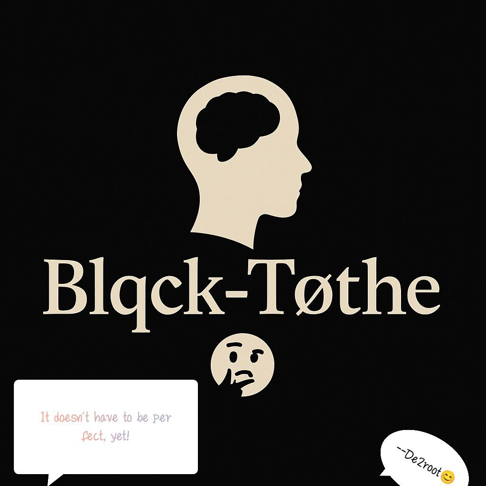

# 🌐 Techgød | Developer Portfolio

Welcome to **Techgød’s Developer Portfolio** — a modern, accessible, and expressive digital profile that showcases not just skills, but soul. This project is built with clean semantic HTML and CSS, prioritizing usability, inclusivity, and street-inspired creativity through a unique brand identity: **Blqck-Tøthe🌚🤔**.

## 🎯 Purpose

This portfolio highlights:
- My background and personal story
- My education and professional values
- Projects and case studies
- Technical skills and interests
- A visual **image gallery** with lightbox effect (built without JavaScript)
- A contact form powered by [Formspree](https://formspree.io)

---

## 📸 Preview



---

## 🛠 Tech Stack

- **HTML5** – Semantic and accessible structure
- **CSS3** – Responsive design with custom styles
- **Formspree** – Email form handling
- **Lightbox (CSS-only)** – Image viewer with no JavaScript

---

## 📂 Folder Structure

```bash
.
├── index.html
├── styles.css
├── Assets/
│   ├── techgod.png
│   ├── image (1).jpg
│   ├── image (2).jpg
│   └── ... more gallery images ...


🚀 Features
🌍 Accessible Navigation – Includes skip links, aria attributes, and descriptive landmarks

🧠 Blqck-Tøthe🌚🤔 Brand Integration – A culture-forward tech identity

🖼️ Image Gallery – Images with full-screen lightbox (no JS)

📄 Downloadable CV

📬 Formspree Contact Form – Secure form submissions

📬 Contact
GitHub: @Murphylee140808

Email: akindehindeomowumi@gmail.com

Phone: +234-810-441-1111

🧠 Inspiration
This project was inspired and supported by Power Learn Project (PLP) — a platform that empowers African youth to innovate and represent through tech.

📜 License
This project is open-source and available under the MIT License.

💡 “I’m not just coding for the now — I’m coding for a future where everyone feels seen.” – Techgød
